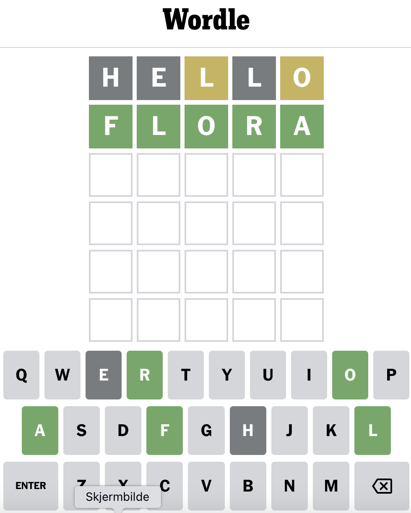

# WORDLE
I denne semesteroppgaven skal jeg utvikle en norsk versjon av wordle. Det originale wordle kan spilles på: [nytimes.com/games/wordle](https://www.nytimes.com/games/wordle/index.html). 

## Hvordan spille wordle
Wordle er et spill som utfordrer spillere til å gjette et tilfeldig generert fem-bokstavers (eller mer) ord ved hjelp av et begrenset antall forsøk. Spillet begynner med at man blir presentert et tomt 5x6 brett. 

### Gjette ordet
Spilleren kan gjette på hvilke som helst bokstaver ved å klikke på tastaturet under brettet, og hvis bokstaven er i ordet, vil spillet vise om den er på riktig posisjon med en grønn bakgrunn, eller i en annen posisjon med en gul bakgrunn. Hvis bokstaven ikke er i ordet, vil den vises i grått. 

### Vinne spillet
Målet med spillet er å gjette ordet innen det tillatte antall forsøk. Hvis spilleren klarer å gjette ordet innen antall forsøk, vil de vinne spillet. Hvis spilleren går tom for forsøk uten å ha gjettet ordet riktig, vil spillet være over og spilleren må starte på nytt.

## Oppbygning av programmet

### WordDictionary
I denne klassen henter man inn en liste med ord, og oppretter en ny liste bestående av ord av kun ønsket lengde. Klassen henter også ut et tilfeldig ord fra denne lista, som brukes i resten av spillet. Denne klassen brukes også for å sjekke om et inntastet ord fra spillerene faktisk er et ekte ord.

### CorrectWord
Denne klassen henter ut det tilfeldige ordet fra WordDictionary, og lagrer dette som fasit. Hensikten med denne klassen er å kunne håndetere alt som har med fasiten å gjøre i kun en klasse. Derfor er det funksjoner i denne klassen som brukes for å sjekke om:
- inntastet bokstav finnes i ordet, dersom den gjør får den statusen (LetterStatus.LETTER_EXISTS)
- inntastet bokstav ikke finnes i ordet, og får da statusen (LetterStatus.LETTER_WRONG)
- inntastet bokstav er på korrekt plass i ordet, og får da statusen (LetterStatus.LETTER_CORRECT)
(Har en funksjon som kan brukes for å lage en "hint" knapp, men fikk ikke tid til å lage den ferdig)

### WordleModel
Denne klassen inneholder logikken som styrer spillet Wordle. Klassen holder styr på hvilke bokstaver spillerene har skrevet inn, samt tidligere komplette ord. Klassen inneholder også metoder som:
- nullstiller spillerens inputs, slik at når man går til neste rad vil man starte tomme ruter
- sjekker om spillerens fullstendige inntastet ord er korrekt
- holder også styr på spillerens nåværende runde og antall ord som er gjettet.

### WordleController
Denne klassen tar imot brukerinputs fra tastaturet, og håndterer disse hendelsene. Klassen kan både fjerne, og legge til bokstaver. Når brukeren trykker på enter-tasten sjekker kontrolleren:
- om brukeren har fyllt inn alle rutene på den nåværende raden
- at ordet til spillerene er ekte, og eventuelt om det er korrekt
- om ordet er feil
Tilslutt lagrer den ordet i den nåværende raden, nullstiller spillerene input.

### ColorTheme
Klassen inneholder fargekoder for alle tegnede elementer i programmet

### WordleView
Denne klassen setter layouten til borderView og oppretter og "knytter" sammen alle de andre view-ene.

#### BorderViewLeft / Right
Disse klassene brukes kun for å ha "padding" til venstre og høyre for gameViewet slik at gameview har kvadratiske ruter, og ikke strekker seg over hele bredden.

#### HeaderView
Denne klassen tegner en header med teksen "WORDLE PÅ NORSK!". Det finnes også en knapp for å "returne til homescreen", men ettersom jeg ikke fikk tid til å implementere en homescreen har denne knappen ingen funksjon (uten om å printe "TILBAKE TIL HOMESCREEN" lol)

#### GameView / LetterLabel / LetterRow / LetterStatusColor
GameView klassen sin hovedfunskjone er å opprette en grid på 6 rader, og varierende lengde kolonner (default 5, ikke implementert variende wordLength pga manglende HomeScreen). Denne klassen har også metoder for å oppdatere rutene i griden.

LetterLabel klassen brukes for å sette ord og status(og farge tilsvarende statusen), i hver rute. Klassen brukes også for å midstille, sette farge, lage kant på rutene, og sette størrelse på bokstavene. Når programmet starter er alle rutene i GameView fylt med tomme mellomrom.

LetterRow klassen inneholder funksjoner for å sette teksten(bokstav) og status i rutene på en rad.

LetterStatusColor klassen brukes for å "oversette" hvilken farge de ulike statusene har.

#### KeyboardView / KeyboardButton / KeyboardBackspace / KeyboardEnter
KeyboardView har som hovedoppgave å tegne tastaturet. Klassen inneholder også en metode for å oppdatere knappenes farge, og status. KeyboardButton oppretter alle knappene, legger til actionslisteners på hver slik at de kan trykkes.
- KeyboardBackspace: egen klasse for håndtering av backspaces
- KeyboardEnter: egen klasse for håndtering av Enter

#### RetryView
I denne klassen opprettes det en knapp man kan trykke på for å starte ett nytt spill, etter man enten har vunnet eller tapt nåværende runde. Denne knappen erstatter keyboard.

#### HomeScreen
Hadde ikke nok tid til å bli ferdig, men planen var at man kunne velge wordLength her.

## Video
[Dropbox link](https://www.dropbox.com/sh/5ofy1wtypdu6dbs/AADAKn8U6OtQU4fM4GgBFkipa?dl=0)

## Kilder
Ordlista som er brukt i spillet er hentet fra [Scrabble Forbundet](http://www2.scrabbleforbundet.no/?p=4881#more-4881). (Publisert 2022, inneholder 700 000+ ord mellom 2 - 15 bokstaver)
